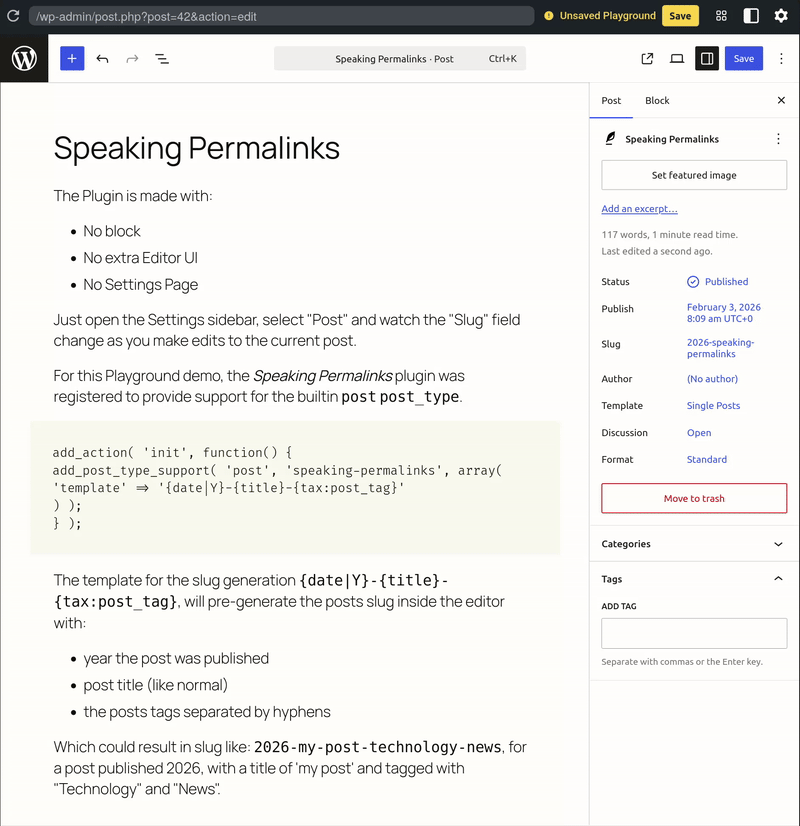

# Speaking Permalinks

**Contributors:**      carstenbach & WordPress Telex  
**Tags:**              permalink, url, post, page, slug, dynamic  
**Tested up to:**      6.8  
**Stable tag:**        0.1.0  
**License:**           GPLv2 or later  
**License URI:**       https://www.gnu.org/licenses/gpl-2.0.html  

A plugin that does automatic slug generation from customizable templates using post data, meta fields, and taxonomy terms.

[](https://playground.wordpress.net/?blueprint-url=https://raw.githubusercontent.com/carstingaxion/speaking-permalinks/main/.wordpress-org/blueprints/blueprint.json) [](https://github.com/carstingaxion/speaking-permalinks/actions/workflows/build-test-measure.yml)

## Motivation

Typically a posts permalink is pre-generated by the post title. That is the same when using the GatherPress plugin.

1. Example of a default event post slug, pre-generated by WordPress.
`https://example.org/events/hamlet`

2. I wanted more speaking links, which is nicer for humans and machines as well. Here is an example of a desired event post slug, pre-generated by WordPress & *speaking-permalinks*: `https://example.org/events/hamlet-main-stage-theater-london-2026`

    An editor could do this change manually, but this plugin does this automatically behind the scenes, based on a defined template: 
    `https://example.org/events/{title}-{tax:_gatherpress_venue}-{meta:venue_information:city}-{meta:gatherpress_datetime_start|Y}`



## Description

The **speaking-permalinks** plugin provides automatic slug generation based on customizable templates. Perfect for creating structured, consistent URLs across your content.

**Key Features:**

* **Dynamic Slug Generation** - Automatically generate slugs from post data and custom fields
* **Post Type Support** - Enable/disable per post type using WordPress post type supports
* **Flexible Templates** - Use WordPress core field names with format options
* **Taxonomy Support** - Include category, tag, and custom taxonomy terms in slugs
* **Array Meta Support** - Access specific array elements in meta fields
* **Real-time Updates** - Slugs update instantly as you edit post content
* **Meta Field Support** - Include custom meta fields in your slug patterns
* **Date Formatting** - Format dates with PHP date format characters
* **Graceful Handling** - Missing fields are silently skipped, no errors
* **Per Post Type** - Control which post types use speaking permalinks


## Installation

1. Upload the plugin files to the `/wp-content/plugins/speaking-permalinks` directory, or install through the WordPress plugins screen
2. Activate the plugin through the 'Plugins' screen in WordPress
3. Speaking permalinks are automatically enabled ONLY for the `gatherpress_event` post type *(because this was my personal need, to create this plugin)*
4. To enable for other post types or customize templates, add something like this to your theme's `functions.php`:

```php
add_action( 'init', function() {
    // Enable for pages with custom template
    add_post_type_support( 'page', 'speaking-permalinks', array(
        'template' => '{date|Y-m-d}-{title}'
    ) );
    
    // Enable for custom post type
    add_post_type_support( 'my_custom_post_type', 'speaking-permalinks', array(
        'template' => '{tax:category}-{title}-{meta:subtitle}'
    ) );
} );
```


## Frequently Asked Questions

### How do I enable speaking permalinks for a post type?

The plugin automatically enables speaking permalinks for the 'post' post type with the default template `{date|Y-m-d}-{title}-{meta:subtitle}`. 

To enable for other post types or customize the template, use the `add_post_type_support()` function:

```php
add_action( 'init', function() {
    add_post_type_support( 'page', 'speaking-permalinks', array(
        'template' => '{date|Y-m-d}-{title}'
    ) );
} );
```

### How do I customize the slug template?

Define the template in the third parameter of `add_post_type_support()`:

```php
add_action( 'init', function() {
    add_post_type_support( 'post', 'speaking-permalinks', array(
        'template' => '{date|Y-m-d}-{tax:category}-{title}'
    ) );
} );
```

You can set different templates for different post types:

```php
add_action( 'init', function() {
    // Posts: date + category + title
    add_post_type_support( 'post', 'speaking-permalinks', array(
        'template' => '{date|Y-m-d}-{tax:category}-{title}'
    ) );
    
    // Pages: just title
    add_post_type_support( 'page', 'speaking-permalinks', array(
        'template' => '{title}'
    ) );
    
    // Events: date + location + title
    add_post_type_support( 'event', 'speaking-permalinks', array(
        'template' => '{date|Y-m-d}-{meta:location}-{title}'
    ) );
} );
```

### What template variables are available?

**Post Fields (WordPress Core):**
* `{title}` - Post title
* `{date}` - Published date
* `{slug}` - Current slug
* `{excerpt}` - Post excerpt
* `{content}` - Post content
* `{author}` - Author ID
* `{status}` - Post status
* `{type}` - Post type

**Meta Fields (Custom):**
* `{meta:subtitle}` - Subtitle meta field
* `{meta:category}` - Custom category
* `{meta:location}` - Location field
* `{meta:any_custom_field}` - Any registered meta field

**Array Meta Fields (Access array elements):**
* `{meta:custom_field:array_key}` - Access specific array element
* `{meta:address:city}` - Get city from address array
* `{meta:location:country}` - Get country from location array
* `{meta:settings:theme}` - Get theme from settings array

**Taxonomy Terms (Categories, Tags, Custom Taxonomies):**
* `{tax:category}` - Category term slugs (multiple separated by hyphens)
* `{tax:post_tag}` - Tag term slugs (multiple separated by hyphens)
* `{tax:custom_taxonomy}` - Custom taxonomy term slugs

**Date Formatting (Works with both post dates and meta dates):**
* `{date|Y-m-d}` - Format post date as YYYY-MM-DD
* `{date|Y}` - Just the year (2026)
* `{date|m}` - Just the month (01)
* `{meta:event_date|Y-m-d}` - Format meta field date as YYYY-MM-DD
* `{meta:event_date|Y}` - Just the year from meta field

Note: Meta fields must be registered with `'show_in_rest' => true`

### How does date formatting work with meta fields?

The system intelligently detects when you're using date format characters (Y, m, d, H, i, s, etc.) and automatically applies date formatting to meta fields that contain date values.

**Example:** If you have a meta field `event_date` storing "2026-05-15":

```php
add_post_type_support( 'event', 'speaking-permalinks', array(
    'template' => '{meta:event_date|Y-m-d}-{title}'
) );
// Result: 2026-05-15-my-event

add_post_type_support( 'event', 'speaking-permalinks', array(
    'template' => '{meta:event_date|Y}-{title}'
) );
// Result: 2026-my-event
```

The system works with various date formats:
* ISO 8601: `2026-05-15` or `2026-05-15T14:30:00`
* Unix timestamps: `1747324800` (seconds) or `1747324800000` (milliseconds)

If a meta field doesn't contain a date value, text formatting will be applied instead.

### How do I use taxonomy terms in slugs?

Use the syntax `{tax:taxonomy_name}` where `taxonomy_name` is the taxonomy slug (e.g., `category`, `post_tag`, or any custom taxonomy).

**Single term:**
If a post has one category "Technology", `{tax:category}` outputs: `technology`

**Multiple terms:**
If a post has categories "Technology" and "News", `{tax:category}` outputs: `technology-news`

**Template examples:**
```php
// Category + title
add_post_type_support( 'post', 'speaking-permalinks', array(
    'template' => '{tax:category}-{title}'
) );
// Result: technology-my-post

// Date + category + title
add_post_type_support( 'post', 'speaking-permalinks', array(
    'template' => '{date|Y-m-d}-{tax:category}-{title}'
) );
// Result: 2026-01-31-technology-news-my-post
```

### How do I use array meta fields?

If your meta field stores an array, you can access specific elements using the syntax `{meta:field_name:array_key}`.

**Example:** If you have a meta field 'event_details' that stores:
```php
array(
    'venue' => 'Conference Hall',
    'city'  => 'San Francisco',
    'year'  => '2026'
)
```

You can use:
* `{meta:event_details:city}` → san-francisco
* `{meta:event_details:year}` → 2026
* `{meta:event_details:venue}` → conference-hall

### Does this work with custom post types?

Yes! You need to explicitly add post type support for each post type where you want speaking permalinks enabled:

```php
add_post_type_support( 'my_custom_post_type', 'speaking-permalinks', array(
    'template' => '{date|Y-m-d}-{title}'
) );
```

### Will slugs update automatically?

Yes, slugs are regenerated in real-time as you edit post content or change taxonomy terms. Changes are debounced by 200ms to prevent excessive updates.

## Template Examples

**Simple date + title:**
```php
add_post_type_support( 'post', 'speaking-permalinks', array(
    'template' => '{date|Y-m-d}-{title}'
) );
```
Result: `2026-01-31-my-great-post`

**Category + title:**
```php
add_post_type_support( 'post', 'speaking-permalinks', array(
    'template' => '{tax:category}-{title}'
) );
```
Result: `technology-my-great-post`

**Date + category + title:**
```php
add_post_type_support( 'post', 'speaking-permalinks', array(
    'template' => '{date|Y-m-d}-{tax:category}-{title}'
) );
```
Result: `2026-01-31-technology-news-my-great-post`


**Include custom meta fields:**
```php
add_post_type_support( 'post', 'speaking-permalinks', array(
    'template' => '{title}-{meta:subtitle}'
) );
```
Result: `my-great-post-an-amazing-subtitle`

## Screenshots

1. Real-time slug updates as you edit post content
2. Custom slug template with date and meta fields
3. Array meta field access in slug templates
4. Taxonomy terms in slug templates

## Changelog

All notable changes to this project will be documented in the [CHANGELOG.md](CHANGELOG.md).
